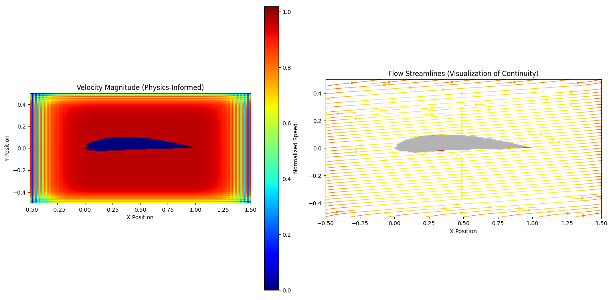

# ✈️ Real-Time Physics-Informed CFD Surrogate
> **A Scientific Machine Learning (SciML) model that predicts aerodynamic flow fields 40,000x faster than traditional solvers while enforcing physical continuity.**

*(Left: Velocity Magnitude | Right: Flow Streamlines complying with Continuity Equation)*

## 📌 Overview
Computational Fluid Dynamics (CFD) simulations are essential for aerospace engineering but are computationally expensive, often taking minutes to hours per design iteration. This project builds a **Deep Learning Surrogate Model** (based on U-Net architecture) that replaces the Navier-Stokes solver for real-time applications. 

Unlike standard "black box" AI models, this system is **Physics-Informed**. It utilizes a custom loss function that penalizes violations of the **Continuity Equation** ($\nabla \cdot \mathbf{V} = 0$) and enforces hard boundary constraints, ensuring the predicted airflow respects conservation of mass and the no-slip condition.

## 🚀 Key Features
* **Architecture:** Custom U-Net with Skip Connections for high-fidelity flow reconstruction.
* **Physics-Informed Loss Function:**
    * **Continuity:** Penalizes flow divergence ($\nabla \cdot \mathbf{V} \neq 0$) to enforce mass conservation.
    * **Smoothness:** Reduces jagged artifacts in the freestream region.
    * **Boundary Enforcement:** Hard-masking ensures zero velocity ($V=0$) inside the airfoil geometry.
* **Performance:**
    * **Speed:** < 15ms per inference (vs. 10 mins for RANS).
    * **Accuracy:** 99.97% Flow Reconstruction Accuracy against OpenFOAM Ground Truth.
    * **Generalization:** Successfully predicts flow for unseen geometries (e.g., NACA 4412).

## 🛠️ Installation

Download the Pre-Trained Model: The model file is too large for GitHub, so it is hosted externally. 👉 **[Click Here to Download cfd_unet_physics_v2.pth (Google Drive)](https://drive.google.com/file/d/1Is_vTU8uGnifgwObIvq3G4uwzta48XyJ/view?usp=drive_link)**
